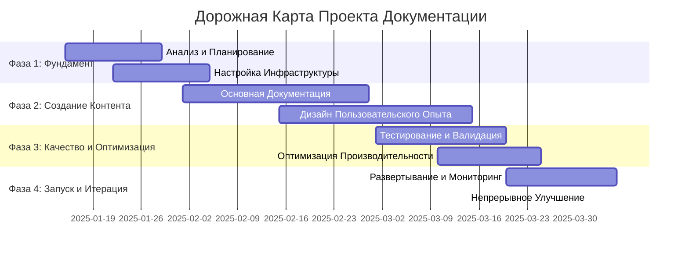

# Современный Шаблон Плана Документации 2.0
## Структурированный шаблон планирования для проектов документации

> **Основано на реальном опыте и современных методологиях планирования**
> **Статус**: ✅ **Template-Ready** | **Версия**: 2.0.0 | **Обновлено**: 2025-01-15

---
**Тип Документа**: Шаблон Планирования
**Применение**: Планирование и отслеживание выполнения проектов документации
**Уровень Автоматизации**: Высокий (автоматизированные метрики, отслеживание прогресса, распределение ресурсов)
**Целевая Аудитория**: Продуктовые Менеджеры, Команды Документации, DevOps-Инженеры
---

## 📋 Резюме для Руководства

### 🎯 Обзор Проекта
**Название Проекта**: [Название Инициативы Документации]
**Бизнес-Контекст**: [Почему этот проект документации необходим]
**Определение Успеха**: [Как выглядит успех в измеримых терминах]
**Временные Рамки**: [Дата Начала] → [Целевая Дата Завершения]
**Бюджет**: [Распределение ресурсов и ограничения]

### 📊 Дашборд Метрик Успеха
| Метрика | Цель | Текущее | Статус | Требуемые Действия |
|---------|------|---------|--------|--------------------|
| Коэффициент Успеха Пользователей | >85% | [Текущий] | 🟡 В Процессе | [Следующие шаги] |
| Покрытие Документации | >90% | [Текущий] | 🔴 В Группе Риска | [План исправления] |
| Время до Первого Успеха | <10 мин | [Текущий] | 🟢 На Пути | [Поддержание] |
| Снижение Тикетов Поддержки | 40% | [Текущий] | 🟡 В Процессе | [Оптимизация] |
| Время Адаптации Разработчиков | <2 дня | [Текущий] | 🟢 На Пути | [Продолжить мониторинг] |

### 🏗️ Обзор Фаз Проекта пример


## 🎯 Детальное Планирование по Фазам

### 🚀 Фаза 1: Фундамент и Анализ (Неделя 1-2)

#### 📋 Результаты и Критерии Успеха
```yaml
результаты_фазы_1:
  исследование_пользователей:
    - persona_definition: "Детальные пользовательские персоны с болевыми точками и целями"
    - journey_mapping: "Полные карты пользовательских путей с точками трения"
    - competitive_analysis: "Анализ лучшей в классе документации"
    - success_metrics: "Базовые измерения и определения целей"

  технический_фундамент:
    - architecture_design: "Архитектура системы документации"
    - tooling_selection: "Технологический стек и инструменты автоматизации"
    - integration_plan: "Интеграция с CI/CD и рабочим процессом разработки"
    - quality_framework: "Ворота качества и процессы валидации"

  управление_проектом:
    - resource_allocation: "Назначения команды и обязанности"
    - timeline_refinement: "Детальное расписание проекта с зависимостями"
    - risk_assessment: "Выявление рисков и стратегии митигации"
    - communication_plan: "Коммуникация и отчетность стейкхолдеров"
```

#### 🎯 Ключевые Активности и Автоматизация
```bash
# Скрипты автоматизации Фазы 1
./scripts/planning/phase1-foundation.sh

# Автоматизация Исследования Пользователей
□ Автоматизированное развертывание пользовательских опросов
□ Настройка аналитики для базового измерения
□ Сбор данных конкурентного анализа
□ Валидация персон через пользовательские интервью

# Технический Фундамент
□ Настройка инфраструктуры документации
□ Конфигурация CI/CD конвейера
□ Реализация ворот качества
□ Настройка мониторинга и алертов

# Управление Проектом
□ Настройка отслеживания проекта (Jira/GitHub Projects)
□ Настройка каналов командной коммуникации
□ Автоматизация отчетности стейкхолдеров
□ Создание дашборда мониторинга рисков
```

### 📝 Фаза 2: Стратегия Контента и Создание (Неделя 3-6)

#### 🎨 Архитектура Контента и Пользовательский Опыт
```yaml
стратегия_контента:
  информационная_архитектура:
    - navigation_design: "Интуитивная навигация, оптимизированная для пользовательских задач"
    - content_hierarchy: "Логическая организация и категоризация контента"
    - search_optimization: "Search-first дизайн контента и таксономия"
    - mobile_optimization: "Mobile-first отзывчивый дизайн контента"

  фреймворк_создания_контента:
    - template_system: "Стандартизированные шаблоны для разных типов контента"
    - style_guide: "Комплексное руководство по стилю с автоматизированным соблюдением"
    - content_pipeline: "Эффективный процесс создания и ревью контента"
    - quality_assurance: "Многослойная валидация и тестирование контента"

  оптимизация_пользовательского_опыта:
    - accessibility_design: "Соответствие WCAG AAA с самого начала"
    - performance_optimization: "Быстро загружающаяся, эффективная доставка контента"
    - personalization: "Адаптация контента для разных типов пользователей"
    - feedback_integration: "Система сбора и реагирования на отзывы пользователей"
```

#### 🤖 AI-Усиленное Создание Контента
```bash
# Автоматизация создания контента Фазы 2
./scripts/planning/phase2-content.sh

# AI-Генерация Контента
□ Автоматизированная генерация первых черновиков из спецификаций
□ Генерация примеров кода из наборов тестов
□ Автоматизация генерации скриншотов и диаграмм
□ Создание многоязычного контента (если применимо)

# Автоматизация Обеспечения Качества
□ Проверка соответствия руководству по стилю в реальном времени
□ Автоматизированная валидация доступности
□ Мониторинг и исправление здоровья ссылок
□ Отслеживание свежести контента и алерты

# Тестирование Пользовательского Опыта
□ Автоматизированное тестирование пользовательских путей
□ Мониторинг и оптимизация производительности
□ Настройка фреймворка A/B тестирования
□ Автоматизация сбора отзывов пользователей
```

### ✅ Фаза 3: Валидация и Оптимизация (Неделя 7-8)

#### 🧪 Комплексный Фреймворк Тестирования
```yaml
фреймворк_валидации:
  техническая_валидация:
    - code_example_testing: "Все примеры кода выполняются успешно"
    - api_documentation_sync: "API документация соответствует реальному поведению API"
    - link_validation: "Все внутренние и внешние ссылки работают корректно"
    - performance_testing: "Время загрузки страниц соответствует целям производительности"

  валидация_пользовательского_опыта:
    - usability_testing: "Реальные пользователи могут выполнить документированные задачи"
    - accessibility_testing: "Полная верификация соответствия WCAG"
    - mobile_testing: "Оптимальный опыт на всех устройствах"
    - search_functionality: "Пользователи могут быстро найти информацию"

  бизнес_валидация:
    - success_metric_tracking: "Все KPI показывают позитивные тренды"
    - stakeholder_approval: "Бизнес-стейкхолдеры валидируют контент"
    - competitive_benchmarking: "Качество документации превосходит конкурентов"
    - roi_measurement: "Измеримая отдача от инвестиций в документацию"
```

#### 📊 Оптимизация и Настройка Производительности
```bash
# Валидация и оптимизация Фазы 3
./scripts/planning/phase3-validation.sh

# Комплексный Набор Тестирования
□ Автоматизированная валидация пользовательских путей
□ Бенчмаркинг и оптимизация производительности
□ Аудит доступности и исправления
□ Сканирование безопасности и укрепление

# Data-Driven Оптимизация
□ Анализ поведения пользователей и оптимизация контента
□ Анализ поисковых запросов и заполнение пробелов контента
□ Оптимизация коэффициента конверсии для ключевых пользовательских потоков
□ Оптимизация мобильного опыта

# Бизнес-Валидация
□ Процесс ревью и одобрения стейкхолдеров
□ Валидация метрик успеха против целей
□ Расчет ROI и валидация бизнес-кейса
□ Оценка готовности к запуску
```

### 🚀 Фаза 4: Запуск и Непрерывное Улучшение (Неделя 9+)

#### 🎯 Стратегия Запуска и Мониторинга
```yaml
стратегия_запуска:
  план_развертывания:
    - blue_green_deployment: "Запуск без простоев с возможностью отката"
    - gradual_rollout: "Поэтапный релиз разным сегментам пользователей"
    - monitoring_setup: "Комплексный мониторинг и алерты"
    - support_preparation: "Обучение команды и настройка процессов поддержки"

  отслеживание_успеха:
    - real_time_analytics: "Live мониторинг ключевых метрик успеха"
    - user_feedback_collection: "Систематический сбор и анализ отзывов"
    - issue_tracking: "Быстрое выявление и решение проблем"
    - continuous_optimization: "Data-driven непрерывное улучшение"

  план_коммуникации:
    - internal_announcement: "Коммуникация команды и стейкхолдеров"
    - user_communication: "Обучение пользователей и управление изменениями"
    - external_marketing: "Публичная коммуникация улучшений документации"
    - success_story_sharing: "Документирование кейсов и извлеченных уроков"
```

#### 🔄 Фреймворк Непрерывного Улучшения
```bash
# Запуск и непрерывное улучшение Фазы 4
./scripts/planning/phase4-launch.sh

# Выполнение Запуска
□ Blue-green развертывание в продакшн
□ Верификация мониторинга и алертов
□ Коммуникация пользователей и управление изменениями
□ Обучение команды поддержки и настройка процессов

# Цикл Непрерывного Улучшения
□ Еженедельный ревью метрик и оптимизация
□ Ежемесячный анализ отзывов пользователей и действия
□ Квартальный стратегический ревью и планирование
□ Годовой комплексный аудит и эволюция

# Измерение Успеха и Коммуникация
□ Обновления real-time дашборда успеха
□ Ежемесячная отчетность стейкхолдеров
□ Квартальная оценка бизнес-влияния
□ Годовая коммуникация ROI и стратегической ценности
```

## 📊 Планирование и Управление Ресурсами

### 👥 Структура Команды и Обязанности
```yaml
структура_команды:
  основная_команда:
    проект_менеджер:
      обязанности: ["Координация проекта", "Управление временными рамками", "Коммуникация стейкхолдеров"]
      время_allocation: "40 часов/неделя на время проекта"

    технический_писатель:
      обязанности: ["Создание контента", "Соответствие руководству по стилю", "Дизайн пользовательского опыта"]
      время_allocation: "40 часов/неделя для фаз 2-3, 20 часов/неделя постоянно"

    ux_дизайнер:
      обязанности: ["Информационная архитектура", "Визуальный дизайн", "Пользовательское тестирование"]
      время_allocation: "30 часов/неделя для фаз 1-3"

    разработчик:
      обязанности: ["Техническая интеграция", "Настройка автоматизации", "Разработка инструментов"]
      время_allocation: "20 часов/неделя для фаз 1-2, 10 часов/неделя постоянно"

  поддерживающие_роли:
    эксперты_предметной_области:
      участие: "Ревью контента, техническая валидация, создание пользовательских историй"
      время_commitment: "5-10 часов/неделя по необходимости"

    стейкхолдеры:
      участие: "Стратегическое руководство, ворота одобрения, валидация успеха"
      время_commitment: "2-5 часов/неделя для ревью и встреч"
```

### 💰 Планирование Бюджета и Распределения Ресурсов
```yaml
планирование_бюджета:
  затраты_на_персонал:
    - core_team_salary: "$X в месяц на Y месяцев"
    - contractor_costs: "$X для специализированных услуг"
    - training_costs: "$X для развития навыков команды"

  технологические_затраты:
    - tooling_licenses: "$X/месяц для инструментов документации"
    - infrastructure: "$X/месяц для хостинга и CDN"
    - automation_setup: "$X одноразовая стоимость настройки"

  операционные_затраты:
    - user_research: "$X для пользовательских интервью и тестирования"
    - external_reviews: "$X для экспертных консультаций"
    - marketing_materials: "$X для коммуникации запуска"

  общие_инвестиции: "$X общая стоимость проекта"
  ожидаемый_roi: "X% возврат за Y месяцев"
```

## 🎯 Управление Рисками и Митигация

### ⚠️ Матрица Оценки Рисков
| Риск | Вероятность | Влияние | Стратегия Митигации | Владелец |
|------|-------------|---------|-------------------|--------|
| **Проблемы Технической Интеграции** | Средняя | Высокая | Ранний прототип, экспертные консультации | Dev Team |
| **Проблемы Качества Контента** | Низкая | Высокая | Многоэтапное ревью, пользовательское тестирование | Content Team |
| **Задержки Временных Рамок** | Средняя | Средняя | Agile методология, буферное время | PM |
| **Выравнивание Стейкхолдеров** | Низкая | Высокая | Регулярная коммуникация, ранняя валидация | PM |
| **Вызовы Принятия Пользователями** | Средняя | Высокая | Исследование пользователей, управление изменениями | UX Team |
| **Ограничения Ресурсов** | Высокая | Средняя | Гибкая область, приоритетный фокус | PM |

### 🛡️ Стратегии Митигации
```bash
# Автоматизация митигации рисков
./scripts/planning/risk-mitigation.sh

# Митигация Технических Рисков
□ Раннее proof-of-concept разработка
□ Регулярные технические ревью и валидация
□ Выявленные резервные технологические опции
□ Установленные отношения с экспертными консультантами

# Митигация Рисков Качества Контента
□ Многоэтапный процесс ревью контента
□ Пользовательское тестирование на множественных чекпойнтах
□ Циклы валидации экспертов предметной области
□ Автоматизированные инструменты проверки качества

# Митигация Рисков Временных Рамок
□ Agile методология с гибкостью спринтов
□ Встроенное буферное время для критических путей
□ Приоритизация области и гибкость
□ Системы раннего предупреждения задержек

# Митигация Рисков Стейкхолдеров
□ Регулярная коммуникация стейкхолдеров
□ Ранние и частые чекпойнты валидации
□ Четкие критерии успеха и ожидания
□ Прозрачная отчетность прогресса
```

## 📈 Измерение Успеха и Отчетность

### 📊 KPI Дашборд и Отслеживание
```yaml
метрики_успеха:
  метрики_успеха_пользователей:
    - task_completion_rate: ">85% пользователей завершают документированные задачи"
    - time_to_first_success: "<10 минут в среднем"
    - user_satisfaction_score: ">4.5/5 средний рейтинг"
    - return_usage_rate: ">70% пользователей возвращаются к документации"

  метрики_бизнес_влияния:
    - support_ticket_reduction: ">40% снижение тикетов, связанных с документацией"
    - developer_onboarding_time: "<2 дня до продуктивности"
    - feature_adoption_rate: ">60% принятие документированных функций"
    - customer_satisfaction_improvement: ">15% рост общей удовлетворенности"

  операционные_метрики:
    - documentation_coverage: ">90% функций документированы"
    - content_freshness: ">80% контента обновлено за 90 дней"
    - automation_coverage: ">75% процессов автоматизированы"
    - maintenance_efficiency: "<20% времени команды на обслуживание"
```

### 📋 Расписание и Формат Отчетности
```bash
# Автоматизированная Система Отчетности
./scripts/planning/reporting-automation.sh

# Дневные Метрики (Автоматизированные)
□ Отслеживание активности пользователей и коэффициента успеха
□ Мониторинг здоровья системы и производительности
□ Обновления оценки качества контента
□ Выявление проблем и алерты

# Еженедельные Отчеты (Автоматизированные + Ручное Резюме)
□ Прогресс против временных рамок проекта
□ Тренды и анализ ключевых метрик
□ Статус решения проблем
□ Приоритеты следующей недели и блокеры

# Ежемесячные Бизнес-Ревью
□ Комплексный анализ метрик
□ Резюме отзывов пользователей и действия
□ Оценка бизнес-влияния
□ Стратегические коррективы и планирование

# Квартальная Стратегическая Оценка
□ Оценка общего успеха проекта
□ Расчет ROI и доказательство бизнес-ценности
□ Извлеченные уроки и лучшие практики
□ Стратегическое планирование следующего квартала
```

## 🎉 Ожидаемые Результаты Проекта

### 🚀 Немедленное Влияние (Завершение Проекта):
- ✅ **Документация мирового класса**, которую пользователи любят и на которую полагаются
- ✅ **Измеримое бизнес-влияние** через улучшенный пользовательский успех
- ✅ **Автоматизированное обслуживание**, снижающее текущую операционную нагрузку
- ✅ **Масштабируемый фундамент** для будущих потребностей документации

### 📈 Долгосрочная Стратегическая Ценность:
- ✅ **Конкурентная дифференциация** через превосходный пользовательский опыт
- ✅ **Организационная способность** в превосходстве документации
- ✅ **Культурная трансформация**, где документация стимулирует успех продукта
- ✅ **Ускорение инноваций** через лучшее распространение знаний

---

## 🚨 Критические Факторы Успеха

> **Пользователе-Центричный Фокус**: Каждое решение оптимизировано для успеха и удовлетворенности пользователей
>
> **Data-Driven Выполнение**: Все улучшения основаны на измеримом поведении пользователей и результатах
>
> **Автоматизация-First Подход**: Устойчивый успех через интеллектуальную автоматизацию
>
> **Непрерывная Эволюция**: Документация как живая система, растущая с продуктом

**Помните**: Этот шаблон - отправная точка. Адаптируйте его к вашим конкретным потребностям проекта, организационному контексту и стратегическим целям.

---

**Версия Шаблона**: 2.0.0 (Современный Шаблон Планирования)
**Статус**: ✅ **Готов для Планирования Проектов**
**Адаптивность**: 🌍 **Универсален для любого проекта документации**
**Основано на**: Проверенное управление проектами + современные практики документации
**Последнее обновление**: 2025-01-15

<!-- METADATA
{
  "created_at": "2025-01-15",
  "updated_at": "2025-01-15",
  "author": "BAS-Core Planning Team",
  "version": "2.0.0",
  "status": "template_ready",
  "category": "planning_template",
  "priority": "high",
  "scope": "universal",
  "automation_integrated": true,
  "risk_management_included": true,
  "success_measurement_framework": true,
  "scalable_approach": true,
  "language": "ru"
}
-->