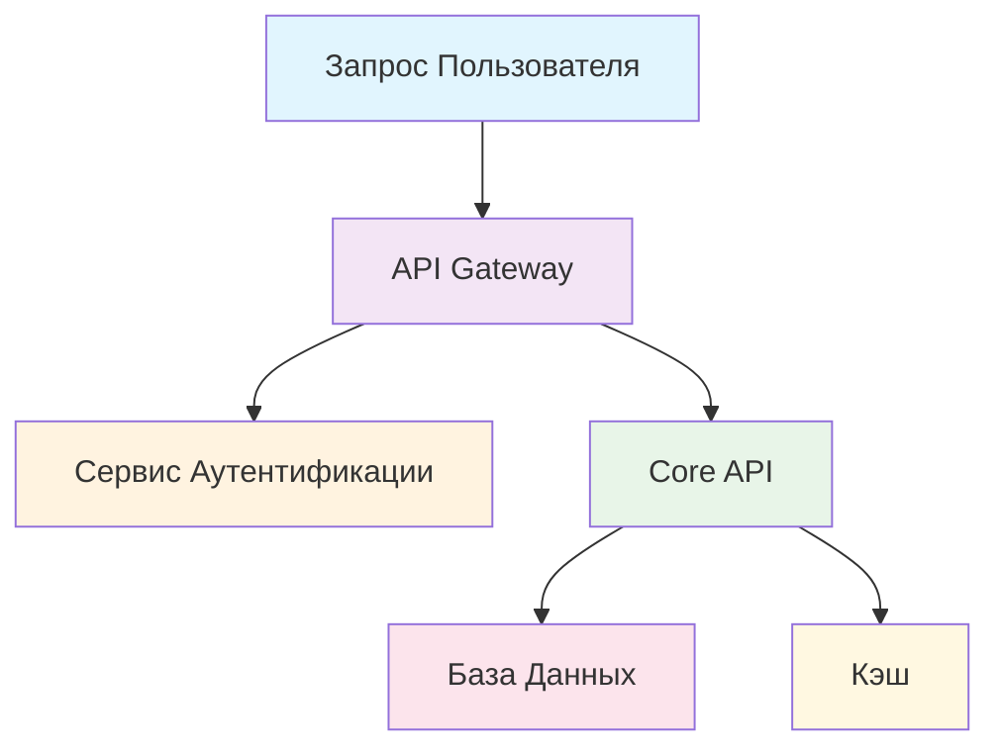

# Современное Руководство по Стилю Документации 2.0
## Универсальные стандарты стиля для профессиональной документации

> **Основано на реальном опыте BAS-Core и промышленных стандартах**
> **Статус**: ✅ **Production-Ready** | **Версия**: 2.0.0 | **Обновлено**: 2025-01-15

## 🎯 Современная Философия Стиля

### 📋 Основные Принципы

1. **Дизайн, Ориентированный на Пользователя** - Каждое решение по стилю оптимизирует понимание читателем
2. **Доступность по Умолчанию** - Инклюзивный дизайн для всех пользователей и способностей
3. **Сканируемый Контент** - Структура обеспечивает быстрое обнаружение информации
4. **Консистентность в Масштабе** - Автоматизированное соблюдение стандартов стиля
5. **Мульти-Платформенная Оптимизация** - Работает на веб, мобильных, печатных и вспомогательных технологиях

## 📝 Типографика и Визуальная Иерархия

### 🎨 Структура и Использование Заголовков

**Умная Иерархия Заголовков:**
```markdown
# H1: Заголовок Документа (только один на документ)
## H2: Основные Разделы
### H3: Подразделы
#### H4: Детальные Разбивки
##### H5: Конкретные Детали (избегать если возможно)

# ✅ ХОРОШО: Ясная информационная архитектура
# Универсальные Правила Документации 2.0

## Обязательные Правила
### Правило #1: Соблюдение SSOT
#### Детали Реализации
##### Техническая Конфигурация

# ❌ ПЛОХО: Пропущенные уровни, неясная иерархия
# Руководство по Документации
#### Реализация
### Правила
```

**Лучшие Практики Заголовков:**
```yaml
стандарты_заголовков:
  структура:
    - use_descriptive_titles: "Что изучит пользователь?"
    - include_action_words: "Настройка, Конфигурация, Развертывание, Устранение неполадок"
    - keep_scannable: "Максимум 8-12 слов на заголовок"
    - maintain_parallel_structure: "Используйте консистентные грамматические паттерны"

  доступность:
    - logical_order: "Никогда не пропускайте уровни заголовков"
    - descriptive_content: "Заголовки должны иметь смысл вне контекста"
    - screen_reader_friendly: "Избегайте символов как носителей смысла"

  автоматизация:
    - auto_toc_generation: "Заголовки автоматически создают оглавление"
    - link_targets: "Все заголовки становятся ссылаемыми якорями"
    - search_optimization: "Заголовки - основные цели поиска"
```

### 🔤 Стандарты Типографики

**Правила Профессиональной Типографики:**
```markdown
## Иерархия Форматирования Текста

### Уровни Выделения:
- **Полужирный**: Ключевые термины, важные предупреждения, основные действия
- *Курсив*: Выделение, технические термины при первом использовании, названия элементов UI
- `Код`: Команды, имена файлов, API endpoints, значения конфигурации
- ***Полужирный + Курсив***: Редко, только для критических предупреждений

### Код и Технический Контент:
```yaml
# Пример конфигурации
api:
  endpoint: "https://api.example.com/v1"
  timeout: 30
  retry_attempts: 3
```

### Списки и Структура:
1. **Нумерованные списки**: Пошаговые процедуры, ранжированные элементы
2. **Маркированные списки**: Связанные элементы, списки функций, варианты
3. **Списки определений**: Термины глоссария, описания параметров
4. **Списки задач**: Чекбоксы для actionable элементов

### Ссылки и Референсы:
- [Описательный Текст Ссылки](url) - Четко объясняет назначение
- **Внутренние ссылки**: `[Руководство по Настройке](../setup/installation.md)`
- **Внешние ссылки**: `[Спецификация OpenAPI](https://spec.openapis.org/oas/v3.0.3)`
```

**Продвинутые Возможности Типографики:**
```markdown
### Умные Кавычки и Типографика:
- Используйте «умные кавычки» не "прямые кавычки"
- Тире для разрывов — как здесь
- Правильное многоточие… не три точки
- Корректные апострофы в сокращениях: don't, won't, it's

### Стандарты Технического Контента:
- API endpoints: `GET /api/v1/users`
- Пути файлов: `/etc/nginx/nginx.conf`
- Переменные окружения: `$HOME`, `${API_KEY}`
- Команды: `docker compose up -d`
- Блоки кода с подсветкой синтаксиса:

```bash
# Установка зависимостей
npm install --production

# Запуск сервисов
./scripts/start-all.sh
```
```

## 🌍 Доступность и Инклюзивный Дизайн

### ♿ Универсальные Стандарты Доступности

**Соответствие WCAG AAA:**
```yaml
требования_доступности:
  визуальный_дизайн:
    - color_contrast: "Минимум 7:1 для обычного текста, 4.5:1 для крупного текста"
    - color_independence: "Никогда не полагайтесь только на цвет для передачи информации"
    - font_sizing: "Минимум 16px базовый шрифт, масштабируемый до 200%"
    - line_spacing: "Минимум 1.5x межстрочный интервал для читаемости"

  структура_контента:
    - logical_reading_order: "Контент течет логично без CSS"
    - descriptive_headings: "Заголовки точно описывают контент"
    - meaningful_links: "Текст ссылки описывает назначение"
    - alt_text: "Все изображения имеют описательный альтернативный текст"

  интерактивные_элементы:
    - keyboard_navigation: "Все интерактивные элементы доступны с клавиатуры"
    - focus_indicators: "Четкие визуальные индикаторы фокуса"
    - skip_links: "Навигация 'пропустить к основному контенту'"
    - error_descriptions: "Четкие сообщения об ошибках и инструкции восстановления"
```

**Руководящие Принципы Инклюзивного Языка:**
```markdown
### Используйте Инклюзивный и Ясный Язык:

✅ ИНКЛЮЗИВНО:
- "Нажмите кнопку Отправить" (четкое действие)
- "Когда процесс завершится..." (нейтрально)
- "Если вы столкнетесь с ошибкой..." (поддерживающе)
- "Система будет..." (четкая субъектность)

❌ ИСКЛЮЧАЮЩЕ/НЕЯСНО:
- "Очевидно, просто нажмите..." (предполагает знания)
- "Просто сделайте это..." (минимизирует сложность)
- "Ребята, когда вы..." (неинклюзивное обращение)
- "Это легко..." (пренебрежительно к сложности)

### Лучшие Практики Технического Письма:
- Используйте активный залог: "Настройте сервер" не "Сервер должен быть настроен"
- Пишите кратко: Удаляйте ненужные слова без потери ясности
- Определяйте акронимы: "API (Application Programming Interface)"
- Используйте параллельную структуру: "Установить, настроить и развернуть" не "Установить, настройка и развернуть"
```

## 📊 Организация Контента и Структура

### 🎯 Информационная Архитектура

**Шаблон Структуры Документа:**
```markdown
# Заголовок Документа
> Краткое описание того, что покрывает этот документ (1-2 предложения)

## 📋 Содержание (для документов >1000 слов)
- [Раздел 1](#раздел-1)
- [Раздел 2](#раздел-2)

## Предварительные Условия
- Перечислите что пользователи должны знать/иметь перед началом
- Ссылки на предварительную документацию

## Быстрый Старт (если применимо)
- 3-5 минутная версия для опытных пользователей
- Ссылка на детальное руководство для начинающих

## Основные Разделы Контента
### Организованы по пользовательскому пути или логическому потоку

## Примеры
- Примеры из реального мира, работающие
- Копируемые фрагменты кода
- Ожидаемые выходы

## Устранение Неполадок
- Общие проблемы и решения
- Как получить помощь

## Связанные Ресурсы
- Перекрестные ссылки на связанную документацию
- Внешние ресурсы и стандарты

## Приложение (если нужно)
- Справочный материал
- Продвинутые опции конфигурации
```

**Оптимизация Потока Контента:**
```yaml
организация_контента:
  перевернутая_пирамида:
    - most_important_first: "Ведите с ключевой информации"
    - progressive_detail: "Добавляйте детали по мере углубления"
    - scannable_structure: "Используйте заголовки и списки для беглого просмотра"

  выравнивание_пользовательского_пути:
    - getting_started: "Поток адаптации нового пользователя"
    - task_completion: "Пошаговое руководство по задачам"
    - reference: "Информация для быстрого поиска"
    - troubleshooting: "Сопоставление проблема-решение"

  управление_когнитивной_нагрузкой:
    - chunking: "Разбивайте сложную информацию на усваиваемые части"
    - white_space: "Используйте пространство для разделения концепций"
    - visual_cues: "Иконки, эмодзи и форматирование для навигации"
    - progressive_disclosure: "Показывайте детали по требованию"
```

## 💻 Код и Технический Контент

### 🔧 Стандарты Блоков Кода

**Подсветка Синтаксиса и Примеры:**
```yaml
# Пример конфигурации с правильной подсветкой
version: '3.8'
services:
  api:
    image: 'myapp:latest'
    ports:
      - '8080:8080'
    environment:
      - NODE_ENV=production
      - API_KEY=${API_KEY}
```

```bash
# Команды shell с четким комментированием
# Установка зависимостей
npm install

# Запуск development сервера
npm run dev

# Ожидаемый вывод:
# Server running on http://localhost:3000
```

```go
// Go код с правильной документацией
package main

import (
    "fmt"
    "net/http"
)

// StartServer инициализирует и запускает HTTP сервер
func StartServer(port string) error {
    http.HandleFunc("/health", healthHandler)

    fmt.Printf("Server starting on port %s\n", port)
    return http.ListenAndServe(":"+port, nil)
}
```

**Стандарты Документации Кода:**
```markdown
### Лучшие Практики Блоков Кода:

1. **Всегда указывайте язык**: Включите подсветку синтаксиса
2. **Включайте контекст**: Комментарии, объясняющие что делает код
3. **Показывайте ожидаемый вывод**: Помогите пользователям проверить успех
4. **Делайте копируемым**: Удалите номера строк из копируемого кода
5. **Тестируйте все примеры**: Убедитесь что код действительно работает
6. **Обновляйте регулярно**: Держите примеры актуальными с последними версиями

### Примеры Командной Строки:
```bash
# Шаг 1: Клонируйте репозиторий
git clone https://github.com/example/repo.git
cd repo

# Шаг 2: Установите зависимости
./scripts/install-dependencies.sh

# Ожидаемый вывод:
# ✅ Dependencies installed successfully
# ✅ Configuration validated
# 🚀 Ready to start development

# Шаг 3: Запустите среду разработки
make dev

# Это будет:
# - Запустить контейнеры базы данных
# - Запустить API сервер на :8080
# - Запустить frontend dev сервер на :3000
# - Открыть браузер на http://localhost:3000
```
```

### 📋 Стиль Документации API

**Консистентная Документация API:**
```markdown
## Аутентификация

Все API запросы требуют аутентификации с использованием Bearer токенов.

### Заголовки Запроса:
```http
Authorization: Bearer <your-api-token>
Content-Type: application/json
```

### Пример Запроса:
```bash
curl -X POST https://api.example.com/v1/users \
  -H "Authorization: Bearer your-api-token-here" \
  -H "Content-Type: application/json" \
  -d '{
    "name": "Иван Иванов",
    "email": "ivan@example.com"
  }'
```

### Пример Ответа:
```json
{
  "id": "user_123456789",
  "name": "Иван Иванов",
  "email": "ivan@example.com",
  "created_at": "2025-01-15T10:30:00Z",
  "status": "active"
}
```

### Ответы с Ошибками:
```json
{
  "error": {
    "code": "INVALID_REQUEST",
    "message": "Этот адрес электронной почты уже используется",
    "details": {
      "field": "email",
      "value": "ivan@example.com"
    }
  }
}
```
```

## 🎯 MDX и Docusaurus Специфичные Элементы

### 📝 MDX Компоненты и Интерактивность

**Использование React компонентов в документации:**
```mdx
---
title: "Интерактивная документация"
description: "Пример использования MDX компонентов"
---

import Tabs from '@theme/Tabs';
import TabItem from '@theme/TabItem';
import CodeBlock from '@theme/CodeBlock';
import Admonition from '@theme/Admonition';

# Интерактивные примеры

<Tabs>
  <TabItem value="curl" label="cURL" default>

```bash
curl -X POST https://api.example.com/auth \
  -H "Content-Type: application/json" \
  -d '{"username": "user", "password": "pass"}'
```

  </TabItem>
  <TabItem value="javascript" label="JavaScript">

```javascript
const response = await fetch('https://api.example.com/auth', {
  method: 'POST',
  headers: {'Content-Type': 'application/json'},
  body: JSON.stringify({username: 'user', password: 'pass'})
});
```

  </TabItem>
  <TabItem value="python" label="Python">

```python
import requests
response = requests.post('https://api.example.com/auth',
  json={'username': 'user', 'password': 'pass'})
```

  </TabItem>
</Tabs>
```

### 🔔 Admonitions (Блоки уведомлений)

**Стандартные типы Admonitions в Docusaurus:**

```markdown
:::note Примечание
Важная информация, которую пользователи должны знать.
Используется для дополнительной информации и контекста.
:::

:::tip Совет
Полезный совет для более эффективной работы.
Помогает пользователям работать умнее, а не тяжелее.
:::

:::info Информация
Дополнительная информация для контекста.
Предоставляет фоновую информацию или дополнительные детали.
:::

:::caution Внимание
Будьте осторожны при выполнении этого действия.
Предупреждает о потенциальных проблемах или подводных камнях.
:::

:::danger Опасность
Это может привести к потере данных или другим серьезным проблемам.
Используйте только для критических предупреждений.
:::

:::warning Предупреждение
Устаревший функционал или важное предостережение.
Указывает на deprecated функции или важные изменения.
:::
```

**Кастомные Admonitions с заголовками:**
```markdown
:::note[Кастомный заголовок]
Вы можете использовать кастомные заголовки для Admonitions,
добавив текст в квадратных скобках после типа.
:::

:::tip[Профессиональный совет]
Используйте эту функцию для создания более
контекстно-специфичных уведомлений.
:::
```

### 🎨 Интерактивные примеры кода

**Live code blocks (интерактивный код в браузере):**
```mdx
```jsx live
function Example() {
  const [count, setCount] = useState(0);

  return (
    <div style={{padding: '20px', border: '1px solid #ddd', borderRadius: '8px'}}>
      <h3>Интерактивный счетчик</h3>
      <p>Вы нажали {count} раз</p>
      <button
        onClick={() => setCount(count + 1)}
        style={{
          padding: '10px 20px',
          backgroundColor: '#007bff',
          color: 'white',
          border: 'none',
          borderRadius: '4px',
          cursor: 'pointer'
        }}
      >
        Нажми меня
      </button>
    </div>
  );
}
```

### 📋 Details/Summary для сворачиваемого контента

```mdx
import Details from '@theme/Details';

<Details>
<summary>Нажмите чтобы развернуть дополнительную информацию</summary>

Здесь находится дополнительная информация, которая
изначально скрыта и показывается только при клике.

Это полезно для:
- FAQ секций
- Дополнительных примеров
- Продвинутых опций конфигурации
- Деталей реализации

</Details>
```

### 🏷️ Правила использования MDX

```yaml
mdx_best_practices:
  imports:
    - location: "Все импорты в начале файла"
    - grouping: "Группировка по типу (theme, custom, utils)"
    - optimization: "Ленивая загрузка для тяжелых компонентов"

  components:
    - accessibility: "Все интерактивные элементы доступны с клавиатуры"
    - responsiveness: "Компоненты адаптивны для мобильных устройств"
    - error_handling: "Graceful degradation при ошибках"

  performance:
    - bundle_size: "Минимизация размера бандла"
    - code_splitting: "Разделение кода для больших компонентов"
    - caching: "Использование кеширования где возможно"
```

## 🎨 Визуальные Элементы и Медиа

### 📸 Изображения и Диаграммы

**Стандарты Изображений:**
```yaml
требования_к_изображениям:
  технические_спецификации:
    - format: "WebP для современных браузеров, PNG fallback"
    - compression: "Оптимизировано для веб, <500KB на изображение"
    - dimensions: "Подходящие для контента, макс 1200px ширина"
    - retina_support: "2x разрешение для высокой плотности экранов"

  доступность:
    - alt_text: "Описательный альтернативный текст для всех изображений"
    - captions: "Объяснительные подписи где полезно"
    - color_blind_friendly: "Не полагайтесь только на цвет"
    - high_contrast: "Четкие визуальные элементы"

  руководящие_принципы_контента:
    - purposeful: "Каждое изображение служит конкретной функции"
    - current: "Скриншоты отражают текущий UI/UX"
    - annotated: "Выноски подчеркивают важные элементы"
    - consistent: "Единый визуальный стиль во всей документации"
```

**Стандарты Диаграмм:**
```markdown
### Архитектурные Диаграммы:



### Скриншоты UI:
- Снимайте с консистентным разрешением (1200x800)
- Включайте оболочку браузера при показе веб-интерфейсов
- Используйте выносные номера/стрелки для подсветки ключевых элементов
- Обновляйте скриншоты при изменении UI
- Предоставляйте версии как для светлого, так и темного режима когда применимо
```

### 📊 Таблицы и Представление Данных

**Доступный Дизайн Таблиц:**
```markdown
| Параметр | Тип | Обязательно | Описание | Пример |
|----------|-----|-------------|----------|--------|
| `name` | string | ✅ Да | Полное имя пользователя | "Иван Иванов" |
| `email` | string | ✅ Да | Действующий адрес электронной почты | "ivan@example.com" |
| `age` | integer | ❌ Нет | Возраст пользователя в годах | 25 |
| `settings` | object | ❌ Нет | Пользовательские предпочтения | `{"theme": "dark"}` |

### Лучшие Практики Таблиц:
- Всегда включайте заголовки таблиц
- Используйте консистентное форматирование для обязательных/опциональных
- Предоставляйте примеры для сложных типов данных
- Делайте таблицы сканируемыми с подходящими интервалами
- Учитывайте отзывчивый дизайн для мобильного просмотра
```

## 🚀 Интерактивные Элементы

### 🔗 Ссылки и Навигация

**Умная Стратегия Ссылок:**
```markdown
### Внутренние Ссылки:
- Используйте относительные пути: `[Руководство по Настройке](../setup/README.md)`
- Включайте описательный текст: "Смотрите [Руководство по Аутентификации API](api/auth.md) для деталей"
- Ссылайтесь на конкретные разделы: `[Обработка Ошибок](troubleshooting/README.md#common-errors)`

### Внешние Ссылки:
- Открывайте в новой вкладке/окне для внешних сайтов
- Предоставляйте контекст: "Узнайте больше в [официальной документации Docker](https://docs.docker.com/)"
- Включайте предупреждение для внешних ссылок когда критично для безопасности

### Навигационные Помощники:
- Breadcrumb навигация: Главная > Настройка > Конфигурация Базы Данных
- Рекомендации "Следующие шаги" в конце статей
- Предложения связанного контента
- Интеграция функциональности поиска
```

### ✅ Интерактивные Чеклисты

**Actionable Списки Задач:**
```markdown
## Чеклист Перед Развертыванием

### Подготовка Окружения:
- [ ] Переменные окружения настроены
- [ ] Соединение с базой данных протестировано
- [ ] SSL сертификаты установлены
- [ ] Load balancer настроен

### Проверка Безопасности:
- [ ] Аутентификация работает корректно
- [ ] Ограничение скорости API включено
- [ ] Заголовки безопасности настроены
- [ ] Сканирование уязвимостей завершено

### Тестирование Производительности:
- [ ] Нагрузочное тестирование завершено
- [ ] Производительность базы данных оптимизирована
- [ ] CDN настроен и протестирован
- [ ] Дашборды мониторинга операционны

### Обновления Документации:
- [ ] API документация обновлена
- [ ] Руководство по развертыванию проверено
- [ ] Руководство по устранению неполадок обновлено
- [ ] Журнал изменений заполнен
```

## 🔧 Автоматизация и Валидация

### 🤖 Автоматизированное Соблюдение Стиля

**Конфигурация Линтинга Стиля:**
```yaml
# .vale.ini - Автоматизированная проверка стиля
StylesPath = .vale/styles
MinAlertLevel = warning

[*.md]
# Качество письма
vale.Repetition = YES
vale.Wordiness = YES
vale.ReadabilityLevel = YES

# Консистентность терминологии
terminology.IncorrectTerms = YES
terminology.PreferredTerms = YES

# Доступность
accessibility.HeadingStructure = YES
accessibility.AltText = YES
accessibility.LinkText = YES

# Техническое письмо
technical.Abbreviations = YES
technical.CodeStyle = YES
technical.APIStyle = YES
```

**Ворота Качества:**
```bash
# Pre-commit hooks для валидации стиля
.git/hooks/pre-commit:
#!/bin/bash

echo "🔍 Запуск проверок стиля документации..."

# 1. Vale style linting
vale docs/ || exit 1

# 2. Валидация ссылок
markdown-link-check docs/**/*.md || exit 1

# 3. Проверка оптимизации изображений
./scripts/docs/check-image-optimization.sh || exit 1

# 4. Валидация доступности
./scripts/docs/accessibility-check.sh || exit 1

# 5. Оценка читаемости
./scripts/docs/readability-score.sh || exit 1

echo "✅ Все проверки стиля прошли!"
```

### 📊 Метрики Стиля и Мониторинг

**Дашборд Качества Стиля:**
```bash
# Генерация отчета о качестве стиля
./scripts/docs/style-quality-report.sh
# Вывод:
# ┌─────────────────────────────────────────────┐
# │        Здоровье Стиля Документации          │
# ├─────────────────────────────────────────────│
# │ Оценка Читаемости:      B+ (85/100) ✅     │
# │ Оценка Доступности:     AAA (98/100) ✅    │
# │ Оценка Консистентности: 94/100 ✅          │
# │ Здоровье Ссылок:       100% ✅             │
# │ Оптимизация Изображений: 91% ✅            │
# │ Соответствие Style Guide: 96% ✅           │
# └─────────────────────────────────────────────┘
#
# 🎯 Рекомендации по Улучшению:
# - 3 заголовка могли бы быть более описательными
# - 2 изображения нуждаются в сжатии
# - 1 внешняя ссылка нуждается в проверке
```

## 🎉 Ожидаемые Результаты Стиля

### 👥 Для Пользователей:
- ✅ **Более быстрое обнаружение информации** через сканируемую структуру
- ✅ **Универсальная доступность** через устройства и способности
- ✅ **Консистентный опыт** во всей документации
- ✅ **Профессиональный вид**, строящий доверие и уверенность

### 🚀 Для Создателей Контента:
- ✅ **Четкие руководящие принципы стиля**, снижающие усталость от решений
- ✅ **Автоматизированная валидация**, предотвращающая несоответствия стиля
- ✅ **Создание на основе шаблонов**, ускоряющее разработку контента
- ✅ **Метрики качества**, обеспечивающие непрерывное улучшение

### 💼 Для Организации:
- ✅ **Консистентность бренда** во всех точках контакта документации
- ✅ **Сниженная нагрузка на поддержку** через более ясную коммуникацию
- ✅ **Улучшенное принятие пользователями** через лучший пользовательский опыт
- ✅ **Конкурентное преимущество** через профессиональную презентацию

---

## 🚨 Критические Принципы Стиля

> **Консистентность Важнее Креативности**: Лучше быть консистентно хорошим, чем непоследовательно великим
>
> **Доступность Не Подлежит Обсуждению**: Каждое дизайнерское решение должно учитывать всех пользователей
>
> **Успех Пользователя Важнее Самовыражения Автора**: Стиль служит пользователям, не авторам
>
> **Автоматизация Важнее Ручного Процесса**: Стиль должен соблюдаться систематически

**Помните**: Великий стиль невидим для пользователей, но обеспечивает их успех. Плохой стиль создает барьеры и фрустрацию.

---

**Версия**: 2.0.0 (Универсальное Руководство по Стилю)
**Статус**: ✅ **Production-Ready**
**Область применения**: 🌍 **Универсально для всех типов контента**
**Основано на**: WCAG AAA, современная типографика, исследования пользовательского опыта
**Последнее обновление**: 2025-01-15

<!-- METADATA
{
  "created_at": "2025-01-15",
  "updated_at": "2025-01-15",
  "author": "BAS-Core Team",
  "version": "2.0.0",
  "status": "production_ready",
  "category": "style_guide",
  "priority": "high",
  "scope": "universal",
  "accessibility_level": "WCAG_AAA",
  "automation_level": "high",
  "user_tested": true,
  "industry_standard": true,
  "language": "ru"
}
-->