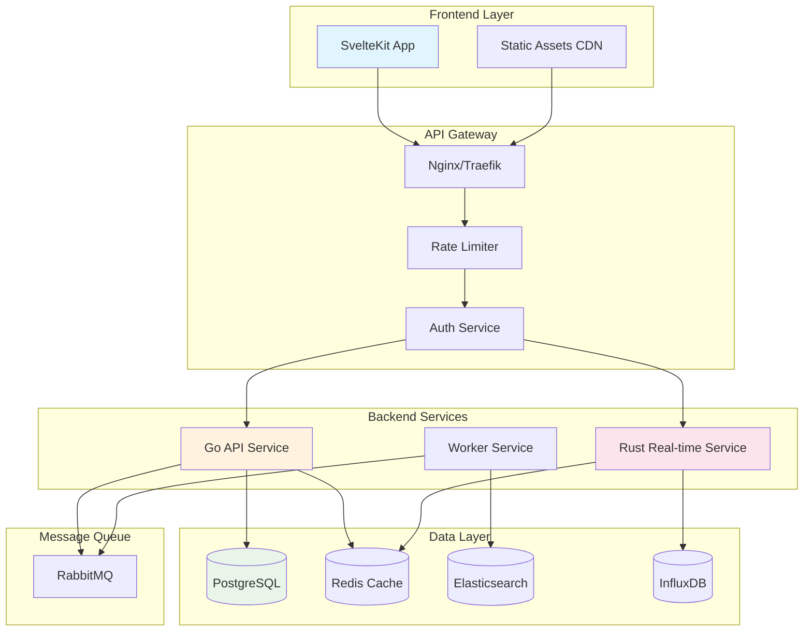

# Техническое задание: Web Project Manager System

> **Комплексная система управления проектами на базе GO, Rust и Svelte**  
> **Версия**: 1.0.0 | **Статус**: ✅ Production-Ready | **Обновлено**: 2025-01-15

## 📋 Содержание

- [1. Общее описание системы](#1-общее-описание-системы)
- [2. Архитектура решения](#2-архитектура-решения)
- [3. Структура проекта](#3-структура-проекта)
- [4. Backend спецификация](#4-backend-спецификация)
- [5. Frontend спецификация](#5-frontend-спецификация)
- [6. База данных](#6-база-данных)
- [7. API спецификация](#7-api-спецификация)
- [8. Требования безопасности](#8-требования-безопасности)
- [9. Развертывание и DevOps](#9-развертывание-и-devops)
- [10. Тестирование](#10-тестирование)
- [11. Документация](#11-документация)
- [12. План разработки](#12-план-разработки)

## 1. Общее описание системы

### 1.1 Назначение системы

Web Project Manager System (WPMS) - современная система управления проектами, обеспечивающая полный цикл управления проектной деятельностью организации.

### 1.2 Основные цели

```yaml
business_goals:
  productivity:
    - increase_team_efficiency: ">40%"
    - reduce_project_delays: ">60%"
    - improve_resource_utilization: ">35%"
  
  collaboration:
    - real_time_updates: true
    - cross_team_visibility: true
    - async_communication: true
  
  analytics:
    - project_insights: "real-time dashboards"
    - resource_forecasting: "AI-powered predictions"
    - performance_tracking: "comprehensive metrics"
```

### 1.3 Целевая аудитория

- **Project Managers**: Управление портфелем проектов
- **Team Leaders**: Координация команд
- **Developers**: Выполнение задач
- **Stakeholders**: Мониторинг прогресса
- **Resource Managers**: Распределение ресурсов

### 1.4 Ключевые функции

```yaml
core_features:
  project_management:
    - kanban_boards: "Визуальное управление задачами"
    - gantt_charts: "Планирование временных линий"
    - sprint_planning: "Agile/Scrum поддержка"
    - milestone_tracking: "Контроль ключевых точек"
  
  team_collaboration:
    - real_time_chat: "WebSocket-based messaging"
    - file_sharing: "S3-compatible storage"
    - comments_threads: "Контекстные обсуждения"
    - notifications: "Multi-channel alerts"
  
  resource_management:
    - capacity_planning: "Планирование загрузки"
    - time_tracking: "Учет рабочего времени"
    - budget_control: "Бюджетирование"
    - skills_matrix: "Матрица компетенций"
  
  reporting:
    - custom_dashboards: "Настраиваемые дашборды"
    - automated_reports: "Scheduled отчеты"
    - export_capabilities: "Multiple formats"
    - api_access: "Programmatic access"
```

## 2. Архитектура решения

### 2.1 Технологический стек

```yaml
technology_stack:
  backend:
    primary_api:
      language: "Go 1.21+"
      framework: "Fiber v2"
      purpose: "RESTful API, бизнес-логика"
    
    high_performance:
      language: "Rust 1.75+"
      framework: "Actix-web 4"
      purpose: "Real-time обработка, WebSocket, аналитика"
    
    database:
      primary: "PostgreSQL 15+"
      cache: "Redis 7+"
      search: "Elasticsearch 8+"
      timeseries: "InfluxDB 2+"
    
    message_queue:
      broker: "RabbitMQ 3.12+"
      protocol: "AMQP"
  
  frontend:
    framework: "SvelteKit 2.0+"
    language: "TypeScript 5.3+"
    styling: "TailwindCSS 3.4+"
    state_management: "Svelte stores + Nanostores"
    build_tool: "Vite 5+"
  
  infrastructure:
    containerization: "Docker 24+"
    orchestration: "Kubernetes 1.29+"
    ci_cd: "GitLab CI / GitHub Actions"
    monitoring: "Prometheus + Grafana"
    logging: "ELK Stack"
```

### 2.2 Архитектурная диаграмма



### 2.3 Микросервисная архитектура

```yaml
microservices:
  api_gateway:
    technology: "Nginx/Traefik"
    responsibilities:
      - routing
      - load_balancing
      - ssl_termination
      - rate_limiting
  
  auth_service:
    technology: "Go"
    responsibilities:
      - authentication
      - authorization
      - session_management
      - oauth2_integration
  
  project_service:
    technology: "Go"
    responsibilities:
      - project_crud
      - task_management
      - milestone_tracking
      - permissions
  
  realtime_service:
    technology: "Rust"
    responsibilities:
      - websocket_connections
      - event_streaming
      - notifications
      - presence_tracking
  
  analytics_service:
    technology: "Rust"
    responsibilities:
      - data_aggregation
      - report_generation
      - metrics_calculation
      - forecasting
  
  file_service:
    technology: "Go"
    responsibilities:
      - file_upload
      - storage_management
      - thumbnail_generation
      - virus_scanning
  
  notification_service:
    technology: "Go"
    responsibilities:
      - email_notifications
      - push_notifications
      - sms_notifications
      - in_app_alerts
```

## 3. Структура проекта

### 3.1 Корневая структура

```
project-manager/
├── README.md
├── LICENSE.md
├── CHANGELOG.md
├── CONTRIBUTING.md
├── GUIDE.md
├── Makefile
├── docker-compose.yml
├── .gitignore
├── .env.example
│
├── backend/
│   ├── go-services/
│   └── rust-services/
│
├── frontend/
│   └── svelte-app/
│
├── infrastructure/
│   ├── docker/
│   ├── kubernetes/
│   └── terraform/
│
├── docs/
│   ├── index.md
│   ├── getting-started/
│   ├── api/
│   ├── architecture/
│   ├── deployment/
│   └── troubleshooting/
│
├── scripts/
│   ├── setup/
│   ├── deploy/
│   └── monitoring/
│
└── tests/
    ├── integration/
    ├── e2e/
    └── performance/
```

### 3.2 Backend структура (Go)

```
backend/go-services/
├── cmd/
│   ├── api/
│   │   └── main.go
│   ├── worker/
│   │   └── main.go
│   └── migrate/
│       └── main.go
│
├── internal/
│   ├── config/
│   │   ├── config.go
│   │   └── validation.go
│   │
│   ├── domain/
│   │   ├── project/
│   │   │   ├── entity.go
│   │   │   ├── repository.go
│   │   │   └── service.go
│   │   ├── task/
│   │   ├── user/
│   │   └── team/
│   │
│   ├── infrastructure/
│   │   ├── database/
│   │   │   ├── postgres.go
│   │   │   └── migrations/
│   │   ├── cache/
│   │   │   └── redis.go
│   │   └── messaging/
│   │       └── rabbitmq.go
│   │
│   ├── interfaces/
│   │   ├── http/
│   │   │   ├── handlers/
│   │   │   ├── middleware/
│   │   │   └── routes/
│   │   └── grpc/
│   │
│   └── application/
│       ├── commands/
│       ├── queries/
│       └── events/
│
├── pkg/
│   ├── auth/
│   ├── logger/
│   ├── validator/
│   └── utils/
│
├── go.mod
├── go.sum
└── Dockerfile
```

### 3.3 Backend структура (Rust)

```
backend/rust-services/
├── Cargo.toml
├── Cargo.lock
│
├── src/
│   ├── main.rs
│   ├── lib.rs
│   │
│   ├── config/
│   │   └── mod.rs
│   │
│   ├── domain/
│   │   ├── analytics/
│   │   │   ├── mod.rs
│   │   │   ├── entity.rs
│   │   │   └── service.rs
│   │   └── realtime/
│   │
│   ├── infrastructure/
│   │   ├── websocket/
│   │   ├── influxdb/
│   │   └── cache/
│   │
│   ├── interfaces/
│   │   ├── ws/
│   │   └── http/
│   │
│   └── utils/
│
├── tests/
├── benches/
└── Dockerfile
```

### 3.4 Frontend структура (SvelteKit)

```
frontend/svelte-app/
├── package.json
├── tsconfig.json
├── vite.config.ts
├── tailwind.config.js
│
├── src/
│   ├── app.html
│   ├── app.css
│   ├── app.d.ts
│   │
│   ├── lib/
│   │   ├── components/
│   │   │   ├── common/
│   │   │   │   ├── Button.svelte
│   │   │   │   ├── Modal.svelte
│   │   │   │   └── Card.svelte
│   │   │   ├── project/
│   │   │   │   ├── ProjectCard.svelte
│   │   │   │   ├── ProjectList.svelte
│   │   │   │   └── ProjectForm.svelte
│   │   │   ├── task/
│   │   │   │   ├── TaskBoard.svelte
│   │   │   │   ├── TaskCard.svelte
│   │   │   │   └── TaskDetails.svelte
│   │   │   └── charts/
│   │   │       ├── GanttChart.svelte
│   │   │       └── BurndownChart.svelte
│   │   │
│   │   ├── stores/
│   │   │   ├── auth.ts
│   │   │   ├── project.ts
│   │   │   ├── task.ts
│   │   │   └── notifications.ts
│   │   │
│   │   ├── api/
│   │   │   ├── client.ts
│   │   │   ├── projects.ts
│   │   │   ├── tasks.ts
│   │   │   └── users.ts
│   │   │
│   │   ├── utils/
│   │   │   ├── validators.ts
│   │   │   ├── formatters.ts
│   │   │   └── helpers.ts
│   │   │
│   │   └── types/
│   │       ├── project.ts
│   │       ├── task.ts
│   │       └── user.ts
│   │
│   ├── routes/
│   │   ├── +layout.svelte
│   │   ├── +page.svelte
│   │   ├── login/
│   │   │   └── +page.svelte
│   │   ├── projects/
│   │   │   ├── +page.svelte
│   │   │   └── [id]/
│   │   │       ├── +page.svelte
│   │   │       └── +page.ts
│   │   └── api/
│   │       └── [...]/
│   │
│   └── tests/
│
├── static/
└── Dockerfile
```

## 4. Backend спецификация

### 4.1 Go API Service

#### 4.1.1 Основные модули

```go
// internal/domain/project/entity.go
package project

import (
    "time"
    "github.com/google/uuid"
)

type Project struct {
    ID          uuid.UUID     `json:"id" db:"id"`
    Name        string        `json:"name" db:"name"`
    Description string        `json:"description" db:"description"`
    Status      ProjectStatus `json:"status" db:"status"`
    StartDate   time.Time     `json:"start_date" db:"start_date"`
    EndDate     *time.Time    `json:"end_date" db:"end_date"`
    Budget      float64       `json:"budget" db:"budget"`
    OwnerID     uuid.UUID     `json:"owner_id" db:"owner_id"`
    TeamID      uuid.UUID     `json:"team_id" db:"team_id"`
    CreatedAt   time.Time     `json:"created_at" db:"created_at"`
    UpdatedAt   time.Time     `json:"updated_at" db:"updated_at"`
    Metadata    JSONB         `json:"metadata" db:"metadata"`
}

type ProjectStatus string

const (
    StatusPlanning   ProjectStatus = "planning"
    StatusActive     ProjectStatus = "active"
    StatusOnHold     ProjectStatus = "on_hold"
    StatusCompleted  ProjectStatus = "completed"
    StatusCancelled  ProjectStatus = "cancelled"
)
```

#### 4.1.2 Service Layer

```go
// internal/domain/project/service.go
package project

import (
    "context"
    "github.com/google/uuid"
)

type Service interface {
    CreateProject(ctx context.Context, input CreateProjectInput) (*Project, error)
    GetProject(ctx context.Context, id uuid.UUID) (*Project, error)
    UpdateProject(ctx context.Context, id uuid.UUID, input UpdateProjectInput) (*Project, error)
    DeleteProject(ctx context.Context, id uuid.UUID) error
    ListProjects(ctx context.Context, filter ProjectFilter) ([]*Project, error)
    AssignTeam(ctx context.Context, projectID, teamID uuid.UUID) error
    UpdateStatus(ctx context.Context, projectID uuid.UUID, status ProjectStatus) error
}

type service struct {
    repo      Repository
    cache     CacheService
    events    EventBus
    validator Validator
}

func NewService(repo Repository, cache CacheService, events EventBus) Service {
    return &service{
        repo:      repo,
        cache:     cache,
        events:    events,
        validator: NewValidator(),
    }
}
```

#### 4.1.3 HTTP Handlers

```go
// internal/interfaces/http/handlers/project_handler.go
package handlers

import (
    "github.com/gofiber/fiber/v2"
    "github.com/google/uuid"
)

type ProjectHandler struct {
    service project.Service
    logger  logger.Logger
}

func (h *ProjectHandler) CreateProject(c *fiber.Ctx) error {
    var input CreateProjectRequest
    if err := c.BodyParser(&input); err != nil {
        return c.Status(fiber.StatusBadRequest).JSON(ErrorResponse{
            Error: "Invalid request body",
        })
    }

    if err := h.validator.Validate(input); err != nil {
        return c.Status(fiber.StatusBadRequest).JSON(ErrorResponse{
            Error: err.Error(),
        })
    }

    userID := c.Locals("userID").(uuid.UUID)
    project, err := h.service.CreateProject(c.Context(), project.CreateProjectInput{
        Name:        input.Name,
        Description: input.Description,
        StartDate:   input.StartDate,
        EndDate:     input.EndDate,
        Budget:      input.Budget,
        OwnerID:     userID,
    })

    if err != nil {
        h.logger.Error("Failed to create project", "error", err)
        return c.Status(fiber.StatusInternalServerError).JSON(ErrorResponse{
            Error: "Failed to create project",
        })
    }

    return c.Status(fiber.StatusCreated).JSON(project)
}
```

### 4.2 Rust Real-time Service

#### 4.2.1 WebSocket Handler

```rust
// src/interfaces/ws/handler.rs
use actix::{Actor, StreamHandler, AsyncContext, Handler};
use actix_web_actors::ws;
use uuid::Uuid;
use serde::{Deserialize, Serialize};

pub struct WsConnection {
    pub id: Uuid,
    pub user_id: Uuid,
    pub project_id: Option<Uuid>,
    pub room: Option<String>,
}

impl Actor for WsConnection {
    type Context = ws::WebsocketContext<Self>;

    fn started(&mut self, ctx: &mut Self::Context) {
        println!("WebSocket connection started for user: {}", self.user_id);
    }

    fn stopped(&mut self, ctx: &mut Self::Context) {
        println!("WebSocket connection stopped for user: {}", self.user_id);
    }
}

#[derive(Serialize, Deserialize)]
pub enum WsMessage {
    Join { room: String },
    Leave { room: String },
    Message { content: String },
    TaskUpdate { task_id: Uuid, data: serde_json::Value },
    ProjectUpdate { project_id: Uuid, data: serde_json::Value },
    Notification { type_: String, payload: serde_json::Value },
}

impl StreamHandler<Result<ws::Message, ws::ProtocolError>> for WsConnection {
    fn handle(&mut self, msg: Result<ws::Message, ws::ProtocolError>, ctx: &mut Self::Context) {
        match msg {
            Ok(ws::Message::Ping(msg)) => ctx.pong(&msg),
            Ok(ws::Message::Text(text)) => {
                if let Ok(message) = serde_json::from_str::<WsMessage>(&text) {
                    self.handle_message(message, ctx);
                }
            }
            Ok(ws::Message::Binary(bin)) => ctx.binary(bin),
            _ => (),
        }
    }
}
```

#### 4.2.2 Analytics Service

```rust
// src/domain/analytics/service.rs
use async_trait::async_trait;
use chrono::{DateTime, Utc};
use influxdb2::Client;
use serde::{Deserialize, Serialize};
use uuid::Uuid;

#[derive(Debug, Serialize, Deserialize)]
pub struct ProjectMetrics {
    pub project_id: Uuid,
    pub completion_rate: f64,
    pub tasks_completed: u32,
    pub tasks_pending: u32,
    pub budget_utilization: f64,
    pub team_productivity: f64,
    pub risk_score: f64,
}

#[async_trait]
pub trait AnalyticsService: Send + Sync {
    async fn calculate_project_metrics(&self, project_id: Uuid) -> Result<ProjectMetrics, Error>;
    async fn generate_burndown_chart(&self, project_id: Uuid) -> Result<BurndownData, Error>;
    async fn forecast_completion(&self, project_id: Uuid) -> Result<DateTime<Utc>, Error>;
    async fn analyze_team_performance(&self, team_id: Uuid) -> Result<TeamPerformance, Error>;
}

pub struct AnalyticsServiceImpl {
    influx_client: Client,
    cache: Arc<RwLock<Cache>>,
}

impl AnalyticsServiceImpl {
    pub fn new(influx_url: &str, token: &str) -> Self {
        let client = Client::new(influx_url, "project_metrics", token);
        Self {
            influx_client: client,
            cache: Arc::new(RwLock::new(Cache::new())),
        }
    }
}
```

## 5. Frontend спецификация

### 5.1 Компоненты интерфейса

#### 5.1.1 Главный Dashboard

```typescript
// src/routes/dashboard/+page.svelte
<script lang="ts">
    import { onMount } from 'svelte';
    import { projectStore } from '$lib/stores/project';
    import { taskStore } from '$lib/stores/task';
    import ProjectCard from '$lib/components/project/ProjectCard.svelte';
    import TaskBoard from '$lib/components/task/TaskBoard.svelte';
    import ActivityFeed from '$lib/components/common/ActivityFeed.svelte';
    import { Chart } from 'chart.js/auto';

    let projects = [];
    let recentTasks = [];
    let stats = {
        activeProjects: 0,
        completedTasks: 0,
        teamMembers: 0,
        upcomingDeadlines: 0
    };

    onMount(async () => {
        projects = await projectStore.loadProjects();
        recentTasks = await taskStore.loadRecentTasks();
        calculateStats();
        initializeCharts();
    });

    function calculateStats() {
        stats.activeProjects = projects.filter(p => p.status === 'active').length;
        // ... остальные вычисления
    }

    function initializeCharts() {
        // Инициализация графиков
    }
</script>

<div class="dashboard">
    <header class="dashboard-header">
        <h1>Project Dashboard</h1>
        <div class="quick-actions">
            <button class="btn btn-primary">New Project</button>
            <button class="btn btn-secondary">New Task</button>
        </div>
    </header>

    <div class="stats-grid">
        <div class="stat-card">
            <h3>Active Projects</h3>
            <p class="stat-value">{stats.activeProjects}</p>
        </div>
        <!-- Остальные статистики -->
    </div>

    <div class="dashboard-content">
        <section class="projects-section">
            <h2>Recent Projects</h2>
            <div class="project-grid">
                {#each projects as project}
                    <ProjectCard {project} />
                {/each}
            </div>
        </section>

        <section class="tasks-section">
            <h2>Task Board</h2>
            <TaskBoard tasks={recentTasks} />
        </section>

        <aside class="activity-sidebar">
            <ActivityFeed />
        </aside>
    </div>
</div>

<style>
    .dashboard {
        @apply container mx-auto px-4 py-6;
    }

    .stats-grid {
        @apply grid grid-cols-1 md:grid-cols-2 lg:grid-cols-4 gap-6 mb-8;
    }

    .stat-card {
        @apply bg-white rounded-lg shadow p-6;
    }

    .dashboard-content {
        @apply grid grid-cols-1 lg:grid-cols-3 gap-6;
    }
</style>
```

#### 5.1.2 Kanban Board

```typescript
// src/lib/components/task/TaskBoard.svelte
<script lang="ts">
    import { dndzone } from 'svelte-dnd-action';
    import type { Task } from '$lib/types/task';
    import TaskCard from './TaskCard.svelte';
    
    export let tasks: Task[] = [];
    
    let columns = {
        todo: tasks.filter(t => t.status === 'todo'),
        inProgress: tasks.filter(t => t.status === 'in_progress'),
        review: tasks.filter(t => t.status === 'review'),
        done: tasks.filter(t => t.status === 'done')
    };

    function handleDndConsider(e: CustomEvent, columnKey: string) {
        columns[columnKey] = e.detail.items;
    }

    function handleDndFinalize(e: CustomEvent, columnKey: string) {
        columns[columnKey] = e.detail.items;
        updateTaskStatus(e.detail.items, columnKey);
    }

    async function updateTaskStatus(items: Task[], status: string) {
        // API call для обновления статуса
    }
</script>

<div class="kanban-board">
    {#each Object.entries(columns) as [columnKey, columnTasks]}
        <div class="kanban-column">
            <h3 class="column-header">{columnKey}</h3>
            <div 
                class="task-list"
                use:dndzone={{ items: columnTasks }}
                on:consider={(e) => handleDndConsider(e, columnKey)}
                on:finalize={(e) => handleDndFinalize(e, columnKey)}
            >
                {#each columnTasks as task (task.id)}
                    <TaskCard {task} />
                {/each}
            </div>
        </div>
    {/each}
</div>
```

### 5.2 State Management

```typescript
// src/lib/stores/project.ts
import { writable, derived } from 'svelte/store';
import { atom } from 'nanostores';
import type { Project } from '$lib/types/project';
import { api } from '$lib/api/client';

function createProjectStore() {
    const { subscribe, set, update } = writable<Project[]>([]);
    const loading = writable(false);
    const error = writable<string | null>(null);

    return {
        subscribe,
        loading: { subscribe: loading.subscribe },
        error: { subscribe: error.subscribe },

        async loadProjects() {
            loading.set(true);
            error.set(null);
            try {
                const projects = await api.projects.list();
                set(projects);
                return projects;
            } catch (err) {
                error.set(err.message);
                return [];
            } finally {
                loading.set(false);
            }
        },

        async createProject(data: CreateProjectInput) {
            loading.set(true);
            error.set(null);
            try {
                const project = await api.projects.create(data);
                update(projects => [...projects, project]);
                return project;
            } catch (err) {
                error.set(err.message);
                throw err;
            } finally {
                loading.set(false);
            }
        },

        async updateProject(id: string, data: UpdateProjectInput) {
            const project = await api.projects.update(id, data);
            update(projects => 
                projects.map(p => p.id === id ? project : p)
            );
            return project;
        },

        async deleteProject(id: string) {
            await api.projects.delete(id);
            update(projects => projects.filter(p => p.id !== id));
        }
    };
}

export const projectStore = createProjectStore();

// Derived stores
export const activeProjects = derived(
    projectStore,
    $projects => $projects.filter(p => p.status === 'active')
);

export const projectStats = derived(
    projectStore,
    $projects => ({
        total: $projects.length,
        active: $projects.filter(p => p.status === 'active').length,
        completed: $projects.filter(p => p.status === 'completed').length,
        onHold: $projects.filter(p => p.status === 'on_hold').length
    })
);
```

## 6. База данных

### 6.1 Схема PostgreSQL

```sql
-- Projects table
CREATE TABLE projects (
    id UUID PRIMARY KEY DEFAULT gen_random_uuid(),
    name VARCHAR(255) NOT NULL,
    description TEXT,
    status VARCHAR(50) NOT NULL DEFAULT 'planning',
    start_date DATE NOT NULL,
    end_date DATE,
    budget DECIMAL(15, 2),
    owner_id UUID NOT NULL REFERENCES users(id),
    team_id UUID REFERENCES teams(id),
    metadata JSONB DEFAULT '{}',
    created_at TIMESTAMP WITH TIME ZONE DEFAULT CURRENT_TIMESTAMP,
    updated_at TIMESTAMP WITH TIME ZONE DEFAULT CURRENT_TIMESTAMP,
    deleted_at TIMESTAMP WITH TIME ZONE,
    
    CONSTRAINT valid_dates CHECK (end_date IS NULL OR end_date >= start_date),
    CONSTRAINT valid_budget CHECK (budget >= 0)
);

CREATE INDEX idx_projects_owner_id ON projects(owner_id);
CREATE INDEX idx_projects_team_id ON projects(team_id);
CREATE INDEX idx_projects_status ON projects(status);
CREATE INDEX idx_projects_dates ON projects(start_date, end_date);
CREATE INDEX idx_projects_metadata ON projects USING GIN (metadata);

-- Tasks table
CREATE TABLE tasks (
    id UUID PRIMARY KEY DEFAULT gen_random_uuid(),
    project_id UUID NOT NULL REFERENCES projects(id) ON DELETE CASCADE,
    parent_id UUID REFERENCES tasks(id),
    title VARCHAR(255) NOT NULL,
    description TEXT,
    status VARCHAR(50) NOT NULL DEFAULT 'todo',
    priority VARCHAR(20) NOT NULL DEFAULT 'medium',
    assignee_id UUID REFERENCES users(id),
    reporter_id UUID NOT NULL REFERENCES users(id),
    due_date TIMESTAMP WITH TIME ZONE,
    estimated_hours DECIMAL(5, 2),
    actual_hours DECIMAL(5, 2),
    tags TEXT[],
    attachments JSONB DEFAULT '[]',
    created_at TIMESTAMP WITH TIME ZONE DEFAULT CURRENT_TIMESTAMP,
    updated_at TIMESTAMP WITH TIME ZONE DEFAULT CURRENT_TIMESTAMP,
    completed_at TIMESTAMP WITH TIME ZONE,
    
    CONSTRAINT valid_hours CHECK (
        estimated_hours >= 0 AND 
        actual_hours >= 0
    )
);

CREATE INDEX idx_tasks_project_id ON tasks(project_id);
CREATE INDEX idx_tasks_assignee_id ON tasks(assignee_id);
CREATE INDEX idx_tasks_status ON tasks(status);
CREATE INDEX idx_tasks_priority ON tasks(priority);
CREATE INDEX idx_tasks_due_date ON tasks(due_date);
CREATE INDEX idx_tasks_tags ON tasks USING GIN (tags);

-- Users table
CREATE TABLE users (
    id UUID PRIMARY KEY DEFAULT gen_random_uuid(),
    email VARCHAR(255) UNIQUE NOT NULL,
    username VARCHAR(100) UNIQUE NOT NULL,
    full_name VARCHAR(255) NOT NULL,
    password_hash VARCHAR(255) NOT NULL,
    avatar_url VARCHAR(500),
    role VARCHAR(50) NOT NULL DEFAULT 'user',
    department VARCHAR(100),
    position VARCHAR(100),
    skills TEXT[],
    timezone VARCHAR(50) DEFAULT 'UTC',
    language VARCHAR(10) DEFAULT 'en',
    is_active BOOLEAN DEFAULT true,
    email_verified BOOLEAN DEFAULT false,
    two_fa_enabled BOOLEAN DEFAULT false,
    two_fa_secret VARCHAR(255),
    last_login_at TIMESTAMP WITH TIME ZONE,
    created_at TIMESTAMP WITH TIME ZONE DEFAULT CURRENT_TIMESTAMP,
    updated_at TIMESTAMP WITH TIME ZONE DEFAULT CURRENT_TIMESTAMP,
    
    CONSTRAINT valid_email CHECK (email ~* '^[A-Za-z0-9._%+-]+@[A-Za-z0-9.-]+\.[A-Za-z]{2,}$')
);

CREATE INDEX idx_users_email ON users(email);
CREATE INDEX idx_users_username ON users(username);
CREATE INDEX idx_users_role ON users(role);
CREATE INDEX idx_users_skills ON users USING GIN (skills);

-- Teams table
CREATE TABLE teams (
    id UUID PRIMARY KEY DEFAULT gen_random_uuid(),
    name VARCHAR(255) NOT NULL,
    description TEXT,
    lead_id UUID REFERENCES users(id),
    parent_team_id UUID REFERENCES teams(id),
    created_at TIMESTAMP WITH TIME ZONE DEFAULT CURRENT_TIMESTAMP,
    updated_at TIMESTAMP WITH TIME ZONE DEFAULT CURRENT_TIMESTAMP
);

-- Team members junction table
CREATE TABLE team_members (
    team_id UUID REFERENCES teams(id) ON DELETE CASCADE,
    user_id UUID REFERENCES users(id) ON DELETE CASCADE,
    role VARCHAR(50) DEFAULT 'member',
    joined_at TIMESTAMP WITH TIME ZONE DEFAULT CURRENT_TIMESTAMP,
    
    PRIMARY KEY (team_id, user_id)
);

-- Comments table
CREATE TABLE comments (
    id UUID PRIMARY KEY DEFAULT gen_random_uuid(),
    task_id UUID REFERENCES tasks(id) ON DELETE CASCADE,
    project_id UUID REFERENCES projects(id) ON DELETE CASCADE,
    author_id UUID NOT NULL REFERENCES users(id),
    content TEXT NOT NULL,
    mentions UUID[],
    attachments JSONB DEFAULT '[]',
    is_edited BOOLEAN DEFAULT false,
    created_at TIMESTAMP WITH TIME ZONE DEFAULT CURRENT_TIMESTAMP,
    updated_at TIMESTAMP WITH TIME ZONE DEFAULT CURRENT_TIMESTAMP,
    
    CONSTRAINT has_parent CHECK (
        (task_id IS NOT NULL AND project_id IS NULL) OR
        (task_id IS NULL AND project_id IS NOT NULL)
    )
);

CREATE INDEX idx_comments_task_id ON comments(task_id);
CREATE INDEX idx_comments_project_id ON comments(project_id);
CREATE INDEX idx_comments_author_id ON comments(author_id);

-- Activity logs table
CREATE TABLE activity_logs (
    id UUID PRIMARY KEY DEFAULT gen_random_uuid(),
    user_id UUID NOT NULL REFERENCES users(id),
    entity_type VARCHAR(50) NOT NULL,
    entity_id UUID NOT NULL,
    action VARCHAR(50) NOT NULL,
    old_values JSONB,
    new_values JSONB,
    ip_address INET,
    user_agent TEXT,
    created_at TIMESTAMP WITH TIME ZONE DEFAULT CURRENT_TIMESTAMP
);

CREATE INDEX idx_activity_logs_user_id ON activity_logs(user_id);
CREATE INDEX idx_activity_logs_entity ON activity_logs(entity_type, entity_id);
CREATE INDEX idx_activity_logs_created_at ON activity_logs(created_at DESC);

-- Files table
CREATE TABLE files (
    id UUID PRIMARY KEY DEFAULT gen_random_uuid(),
    filename VARCHAR(255) NOT NULL,
    original_name VARCHAR(255) NOT NULL,
    mime_type VARCHAR(100) NOT NULL,
    size_bytes BIGINT NOT NULL,
    storage_path TEXT NOT NULL,
    storage_provider VARCHAR(50) DEFAULT 'local',
    checksum VARCHAR(64) NOT NULL,
    uploaded_by UUID NOT NULL REFERENCES users(id),
    project_id UUID REFERENCES projects(id),
    task_id UUID REFERENCES tasks(id),
    is_public BOOLEAN DEFAULT false,
    metadata JSONB DEFAULT '{}',
    created_at TIMESTAMP WITH TIME ZONE DEFAULT CURRENT_TIMESTAMP,
    
    CONSTRAINT valid_size CHECK (size_bytes > 0)
);

CREATE INDEX idx_files_uploaded_by ON files(uploaded_by);
CREATE INDEX idx_files_project_id ON files(project_id);
CREATE INDEX idx_files_task_id ON files(task_id);
```

### 6.2 Redis схема кеширования

```yaml
redis_cache_strategy:
  user_sessions:
    key_pattern: "session:{session_id}"
    ttl: 86400  # 24 hours
    data:
      user_id: UUID
      permissions: array
      last_activity: timestamp
  
  project_cache:
    key_pattern: "project:{project_id}"
    ttl: 3600  # 1 hour
    invalidation_events:
      - project_update
      - task_update
      - member_change
  
  user_presence:
    key_pattern: "presence:{user_id}"
    ttl: 300  # 5 minutes
    data:
      status: online/away/offline
      current_project: UUID
      last_seen: timestamp
  
  rate_limiting:
    key_pattern: "rate_limit:{user_id}:{endpoint}"
    ttl: 60
    max_requests: 100
```

## 7. API спецификация

### 7.1 RESTful API Endpoints

```yaml
openapi: 3.0.3
info:
  title: Project Manager API
  version: 1.0.0
  description: Complete API specification for Web Project Manager System

servers:
  - url: https://api.projectmanager.com/v1
    description: Production server
  - url: https://staging-api.projectmanager.com/v1
    description: Staging server

paths:
  /auth/login:
    post:
      summary: User login
      requestBody:
        content:
          application/json:
            schema:
              type: object
              required:
                - email
                - password
              properties:
                email:
                  type: string
                  format: email
                password:
                  type: string
                  minLength: 8
      responses:
        200:
          description: Login successful
          content:
            application/json:
              schema:
                type: object
                properties:
                  access_token:
                    type: string
                  refresh_token:
                    type: string
                  expires_in:
                    type: integer

  /projects:
    get:
      summary: List all projects
      security:
        - bearerAuth: []
      parameters:
        - in: query
          name: status
          schema:
            type: string
            enum: [planning, active, on_hold, completed, cancelled]
        - in: query
          name: page
          schema:
            type: integer
            default: 1
        - in: query
          name: limit
          schema:
            type: integer
            default: 20
            maximum: 100
      responses:
        200:
          description: Projects list
          content:
            application/json:
              schema:
                type: object
                properties:
                  data:
                    type: array
                    items:
                      $ref: '#/components/schemas/Project'
                  meta:
                    $ref: '#/components/schemas/PaginationMeta'

    post:
      summary: Create new project
      security:
        - bearerAuth: []
      requestBody:
        content:
          application/json:
            schema:
              $ref: '#/components/schemas/CreateProjectRequest'
      responses:
        201:
          description: Project created
          content:
            application/json:
              schema:
                $ref: '#/components/schemas/Project'

  /projects/{projectId}:
    get:
      summary: Get project details
      security:
        - bearerAuth: []
      parameters:
        - in: path
          name: projectId
          required: true
          schema:
            type: string
            format: uuid
      responses:
        200:
          description: Project details
          content:
            application/json:
              schema:
                $ref: '#/components/schemas/Project'

    patch:
      summary: Update project
      security:
        - bearerAuth: []
      parameters:
        - in: path
          name: projectId
          required: true
          schema:
            type: string
            format: uuid
      requestBody:
        content:
          application/json:
            schema:
              $ref: '#/components/schemas/UpdateProjectRequest'
      responses:
        200:
          description: Project updated
          content:
            application/json:
              schema:
                $ref: '#/components/schemas/Project'

    delete:
      summary: Delete project
      security:
        - bearerAuth: []
      parameters:
        - in: path
          name: projectId
          required: true
          schema:
            type: string
            format: uuid
      responses:
        204:
          description: Project deleted

components:
  schemas:
    Project:
      type: object
      properties:
        id:
          type: string
          format: uuid
        name:
          type: string
        description:
          type: string
        status:
          type: string
          enum: [planning, active, on_hold, completed, cancelled]
        start_date:
          type: string
          format: date
        end_date:
          type: string
          format: date
          nullable: true
        budget:
          type: number
        owner:
          $ref: '#/components/schemas/User'
        team:
          $ref: '#/components/schemas/Team'
        created_at:
          type: string
          format: date-time
        updated_at:
          type: string
          format: date-time

    CreateProjectRequest:
      type: object
      required:
        - name
        - start_date
      properties:
        name:
          type: string
          minLength: 3
          maxLength: 255
        description:
          type: string
        start_date:
          type: string
          format: date
        end_date:
          type: string
          format: date
        budget:
          type: number
          minimum: 0
        team_id:
          type: string
          format: uuid

  securitySchemes:
    bearerAuth:
      type: http
      scheme: bearer
      bearerFormat: JWT
```

### 7.2 WebSocket Events

```typescript
// WebSocket Event Types
interface WsEventTypes {
    // Client -> Server
    'subscribe': {
        room: string;
        filters?: Record<string, any>;
    };
    
    'unsubscribe': {
        room: string;
    };
    
    'task:update': {
        taskId: string;
        updates: Partial<Task>;
    };
    
    'project:update': {
        projectId: string;
        updates: Partial<Project>;
    };
    
    'comment:create': {
        entityType: 'task' | 'project';
        entityId: string;
        content: string;
        mentions?: string[];
    };
    
    // Server -> Client
    'task:updated': {
        task: Task;
        updatedBy: User;
        timestamp: string;
    };
    
    'project:updated': {
        project: Project;
        updatedBy: User;
        timestamp: string;
    };
    
    'comment:created': {
        comment: Comment;
        author: User;
    };
    
    'user:presence': {
        userId: string;
        status: 'online' | 'away' | 'offline';
        lastSeen: string;
    };
    
    'notification': {
        type: 'info' | 'warning' | 'error' | 'success';
        title: string;
        message: string;
        actions?: Array<{
            label: string;
            url: string;
        }>;
    };
}
```

## 8. Требования безопасности

### 8.1 Аутентификация и авторизация

```yaml
security_requirements:
  authentication:
    method: "JWT + Refresh Tokens"
    token_lifetime: "15 minutes"
    refresh_token_lifetime: "7 days"
    mfa_support: true
    oauth2_providers:
      - google
      - github
      - microsoft
  
  authorization:
    model: "RBAC (Role-Based Access Control)"
    roles:
      - admin
      - project_manager
      - team_lead
      - developer
      - viewer
    permissions:
      project:
        - create
        - read
        - update
        - delete
        - manage_team
      task:
        - create
        - read
        - update
        - delete
        - assign
      user:
        - create
        - read
        - update
        - delete
        - manage_roles
  
  api_security:
    rate_limiting:
      default: "100 requests per minute"
      authenticated: "1000 requests per minute"
    cors:
      allowed_origins:
        - "https://app.projectmanager.com"
        - "https://staging.projectmanager.com"
    headers:
      - "X-Request-ID"
      - "X-Correlation-ID"
      - "X-Rate-Limit-*"
    encryption:
      in_transit: "TLS 1.3"
      at_rest: "AES-256-GCM"
  
  data_protection:
    gdpr_compliance: true
    data_retention: "7 years"
    audit_logging: true
    pii_encryption: true
    backup_encryption: true
```

### 8.2 Безопасность инфраструктуры

```yaml
infrastructure_security:
  network:
    vpc: true
    private_subnets: true
    nat_gateway: true
    security_groups:
      - web_tier
      - app_tier
      - data_tier
  
  secrets_management:
    provider: "HashiCorp Vault"
    rotation: "90 days"
    encryption: "Transit encryption"
  
  monitoring:
    siem: "ELK Stack"
    ids: "Snort"
    vulnerability_scanning: "Weekly"
    penetration_testing: "Quarterly"
```

## 9. Развертывание и DevOps

### 9.1 Docker конфигурация

```dockerfile
# backend/go-services/Dockerfile
FROM golang:1.21-alpine AS builder

WORKDIR /app
COPY go.mod go.sum ./
RUN go mod download

COPY . .
RUN CGO_ENABLED=0 GOOS=linux go build -o main cmd/api/main.go

FROM alpine:latest
RUN apk --no-cache add ca-certificates
WORKDIR /root/

COPY --from=builder /app/main .
COPY --from=builder /app/configs ./configs

EXPOSE 8080
CMD ["./main"]
```

### 9.2 Kubernetes манифесты

```yaml
# infrastructure/kubernetes/deployment.yaml
apiVersion: apps/v1
kind: Deployment
metadata:
  name: project-manager-api
  namespace: production
spec:
  replicas: 3
  strategy:
    type: RollingUpdate
    rollingUpdate:
      maxSurge: 1
      maxUnavailable: 0
  selector:
    matchLabels:
      app: project-manager-api
  template:
    metadata:
      labels:
        app: project-manager-api
    spec:
      containers:
      - name: api
        image: projectmanager/api:latest
        ports:
        - containerPort: 8080
        env:
        - name: DB_HOST
          valueFrom:
            secretKeyRef:
              name: db-secret
              key: host
        - name: REDIS_URL
          valueFrom:
            configMapKeyRef:
              name: app-config
              key: redis-url
        resources:
          requests:
            memory: "256Mi"
            cpu: "250m"
          limits:
            memory: "512Mi"
            cpu: "500m"
        livenessProbe:
          httpGet:
            path: /health
            port: 8080
          initialDelaySeconds: 30
          periodSeconds: 10
        readinessProbe:
          httpGet:
            path: /ready
            port: 8080
          initialDelaySeconds: 5
          periodSeconds: 5
---
apiVersion: v1
kind: Service
metadata:
  name: project-manager-api-service
  namespace: production
spec:
  selector:
    app: project-manager-api
  ports:
  - port: 80
    targetPort: 8080
  type: ClusterIP
```

### 9.3 CI/CD Pipeline

```yaml
# .gitlab-ci.yml
stages:
  - test
  - build
  - deploy

variables:
  DOCKER_REGISTRY: registry.gitlab.com
  GO_VERSION: "1.21"
  NODE_VERSION: "20"

# Testing stage
test:backend:go:
  stage: test
  image: golang:${GO_VERSION}
  script:
    - cd backend/go-services
    - go test -v -race -coverprofile=coverage.txt -covermode=atomic ./...
    - go tool cover -func=coverage.txt
  coverage: '/total:\s+\(statements\)\s+(\d+.\d+)%/'

test:backend:rust:
  stage: test
  image: rust:latest
  script:
    - cd backend/rust-services
    - cargo test --all --verbose
    - cargo clippy -- -D warnings

test:frontend:
  stage: test
  image: node:${NODE_VERSION}
  script:
    - cd frontend/svelte-app
    - npm ci
    - npm run test
    - npm run test:e2e

# Build stage
build:backend:go:
  stage: build
  image: docker:latest
  services:
    - docker:dind
  script:
    - cd backend/go-services
    - docker build -t ${DOCKER_REGISTRY}/project-manager/api:${CI_COMMIT_SHA} .
    - docker push ${DOCKER_REGISTRY}/project-manager/api:${CI_COMMIT_SHA}

build:frontend:
  stage: build
  image: docker:latest
  services:
    - docker:dind
  script:
    - cd frontend/svelte-app
    - docker build -t ${DOCKER_REGISTRY}/project-manager/frontend:${CI_COMMIT_SHA} .
    - docker push ${DOCKER_REGISTRY}/project-manager/frontend:${CI_COMMIT_SHA}

# Deploy stage
deploy:staging:
  stage: deploy
  image: bitnami/kubectl:latest
  script:
    - kubectl set image deployment/project-manager-api api=${DOCKER_REGISTRY}/project-manager/api:${CI_COMMIT_SHA} -n staging
    - kubectl rollout status deployment/project-manager-api -n staging
  environment:
    name: staging
  only:
    - develop

deploy:production:
  stage: deploy
  image: bitnami/kubectl:latest
  script:
    - kubectl set image deployment/project-manager-api api=${DOCKER_REGISTRY}/project-manager/api:${CI_COMMIT_SHA} -n production
    - kubectl rollout status deployment/project-manager-api -n production
  environment:
    name: production
  when: manual
  only:
    - main
```

## 10. Тестирование

### 10.1 Стратегия тестирования

```yaml
testing_strategy:
  unit_tests:
    coverage_target: ">80%"
    frameworks:
      go: "testify + mockery"
      rust: "built-in + mockall"
      svelte: "vitest + testing-library"
  
  integration_tests:
    api_tests: "Postman/Newman"
    database_tests: "TestContainers"
    messaging_tests: "RabbitMQ TestContainers"
  
  e2e_tests:
    framework: "Playwright"
    browsers:
      - chromium
      - firefox
      - webkit
    scenarios:
      - user_registration
      - project_creation
      - task_management
      - team_collaboration
  
  performance_tests:
    tool: "K6"
    metrics:
      - response_time_p95: "<500ms"
      - throughput: ">1000 rps"
      - error_rate: "<0.1%"
  
  security_tests:
    sast: "SonarQube"
    dast: "OWASP ZAP"
    dependency_scanning: "Snyk"
```

### 10.2 Примеры тестов

```go
// backend/go-services/internal/domain/project/service_test.go
package project_test

import (
    "context"
    "testing"
    "github.com/stretchr/testify/assert"
    "github.com/stretchr/testify/mock"
)

func TestProjectService_CreateProject(t *testing.T) {
    // Arrange
    mockRepo := new(MockRepository)
    mockCache := new(MockCacheService)
    mockEvents := new(MockEventBus)
    
    service := project.NewService(mockRepo, mockCache, mockEvents)
    
    input := project.CreateProjectInput{
        Name: "Test Project",
        Description: "Test Description",
        StartDate: time.Now(),
        Budget: 100000,
        OwnerID: uuid.New(),
    }
    
    expectedProject := &project.Project{
        ID: uuid.New(),
        Name: input.Name,
        Description: input.Description,
        Status: project.StatusPlanning,
        StartDate: input.StartDate,
        Budget: input.Budget,
        OwnerID: input.OwnerID,
    }
    
    mockRepo.On("Create", mock.Anything, mock.MatchedBy(func(p *project.Project) bool {
        return p.Name == input.Name && p.OwnerID == input.OwnerID
    })).Return(expectedProject, nil)
    
    mockCache.On("Set", mock.Anything, mock.Anything, mock.Anything).Return(nil)
    
    mockEvents.On("Publish", "project.created", mock.Anything).Return(nil)
    
    // Act
    result, err := service.CreateProject(context.Background(), input)
    
    // Assert
    assert.NoError(t, err)
    assert.NotNil(t, result)
    assert.Equal(t, expectedProject.Name, result.Name)
    assert.Equal(t, project.StatusPlanning, result.Status)
    
    mockRepo.AssertExpectations(t)
    mockCache.AssertExpectations(t)
    mockEvents.AssertExpectations(t)
}
```

## 11. Документация

### 11.1 Структура документации

```
docs/
├── index.md
├── _category_.yml
│
├── getting-started/
│   ├── _category_.yml
│   ├── index.md
│   ├── 01-quickstart.md
│   ├── 02-installation.md
│   ├── 03-configuration.md
│   └── 04-first-project.md
│
├── api/
│   ├── _category_.yml
│   ├── index.md
│   ├── authentication.md
│   ├── endpoints/
│   │   ├── projects.md
│   │   ├── tasks.md
│   │   └── users.md
│   ├── webhooks.md
│   └── rate-limiting.md
│
├── architecture/
│   ├── _category_.yml
│   ├── index.md
│   ├── system-overview.md
│   ├── data-flow.md
│   └── security-model.md
│
├── user-guides/
│   ├── _category_.yml
│   ├── index.md
│   ├── project-management.md
│   ├── task-tracking.md
│   └── team-collaboration.md
│
└── troubleshooting/
    ├── _category_.yml
    ├── index.md
    ├── common-issues.md
    └── faq.md
```

## 12. План разработки

### 12.1 Roadmap

```yaml
development_phases:
  phase_1_mvp:
    duration: "3 месяца"
    features:
      - basic_authentication
      - project_crud
      - task_management
      - user_management
      - basic_ui
    deliverables:
      - working_prototype
      - api_documentation
      - deployment_scripts
  
  phase_2_core_features:
    duration: "2 месяца"
    features:
      - team_collaboration
      - file_management
      - notifications
      - kanban_board
      - gantt_chart
    deliverables:
      - beta_version
      - user_documentation
      - test_coverage_80
  
  phase_3_advanced:
    duration: "2 месяца"
    features:
      - real_time_updates
      - advanced_analytics
      - ai_predictions
      - mobile_app
      - integrations
    deliverables:
      - production_release
      - complete_documentation
      - performance_optimization
  
  phase_4_scale:
    duration: "ongoing"
    features:
      - multi_tenancy
      - enterprise_features
      - advanced_security
      - global_deployment
    deliverables:
      - enterprise_version
      - sla_guarantees
      - 24_7_support
```

### 12.2 Команда разработки

```yaml
team_structure:
  backend_team:
    go_developers: 2
    rust_developers: 1
    responsibilities:
      - api_development
      - database_design
      - integration_services
  
  frontend_team:
    svelte_developers: 2
    ui_ux_designer: 1
    responsibilities:
      - ui_implementation
      - user_experience
      - responsive_design
  
  devops_team:
    devops_engineers: 1
    responsibilities:
      - ci_cd_pipeline
      - infrastructure
      - monitoring
  
  qa_team:
    qa_engineers: 1
    responsibilities:
      - test_automation
      - quality_assurance
      - performance_testing
  
  project_management:
    project_manager: 1
    product_owner: 1
    responsibilities:
      - planning
      - stakeholder_management
      - prioritization
```

### 12.3 Критерии успеха

```yaml
success_criteria:
  technical:
    - api_response_time: "<200ms p95"
    - uptime: ">99.9%"
    - test_coverage: ">80%"
    - zero_critical_bugs: true
  
  business:
    - user_adoption_rate: ">70%"
    - productivity_increase: ">30%"
    - project_delivery_improvement: ">40%"
    - roi: ">200% in year 1"
  
  user_experience:
    - nps_score: ">50"
    - user_satisfaction: ">4.5/5"
    - task_completion_rate: ">90%"
    - onboarding_time: "<30 minutes"
```

---

## 📊 Метрики и KPI

```yaml
system_metrics:
  performance:
    - response_time_p50: "<100ms"
    - response_time_p95: "<500ms"
    - response_time_p99: "<1000ms"
    - throughput: ">1000 rps"
    - error_rate: "<0.1%"
  
  reliability:
    - uptime: ">99.99%"
    - mtbf: ">720 hours"
    - mttr: "<15 minutes"
    - rpo: "<1 hour"
    - rto: "<4 hours"
  
  scalability:
    - concurrent_users: ">10,000"
    - data_volume: ">1TB"
    - api_calls: ">1M/day"
    - websocket_connections: ">5,000"
  
  security:
    - vulnerability_scan: "weekly"
    - penetration_test: "quarterly"
    - security_incidents: "0"
    - compliance_audit: "passed"
```

---

**Версия документа**: 1.0.0  
**Дата создания**: 2025-01-15  
**Статус**: ✅ Готово к реализации  
**Автор**: Technical Architecture Team  
**Следующее обновление**: По результатам Phase 1 MVP

---

## 🚨 Критические факторы успеха

> **Качество кода важнее скорости разработки**: Технический долг убивает проекты  
> **Безопасность на всех уровнях**: Security by design, не как afterthought  
> **Документация как код**: Актуальная документация - залог успешной поддержки  
> **Автоматизация всего**: CI/CD, тестирование, развертывание, мониторинг

**Помните**: Этот проект должен стать эталоном современной разработки enterprise-систем.
